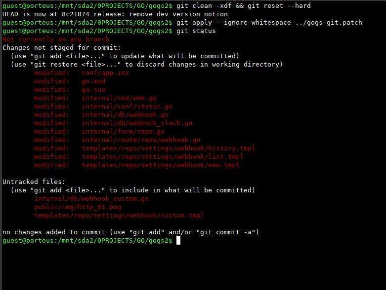
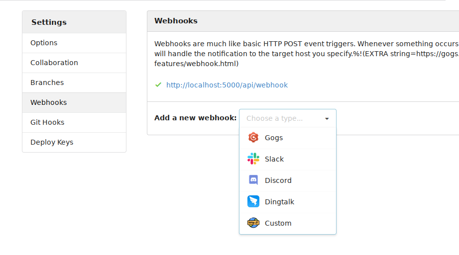
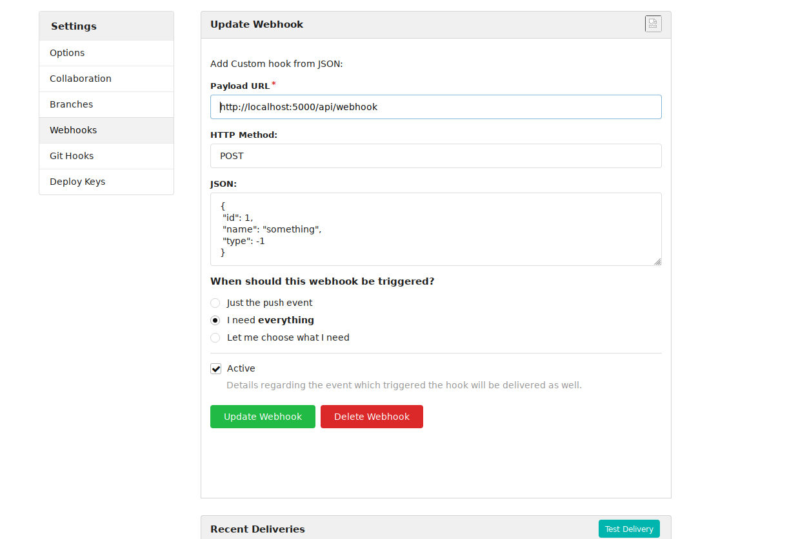
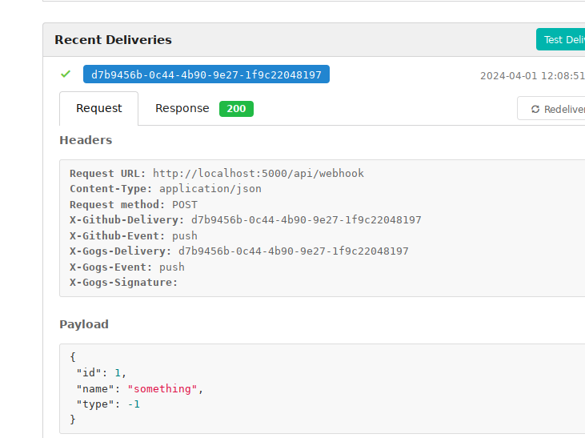
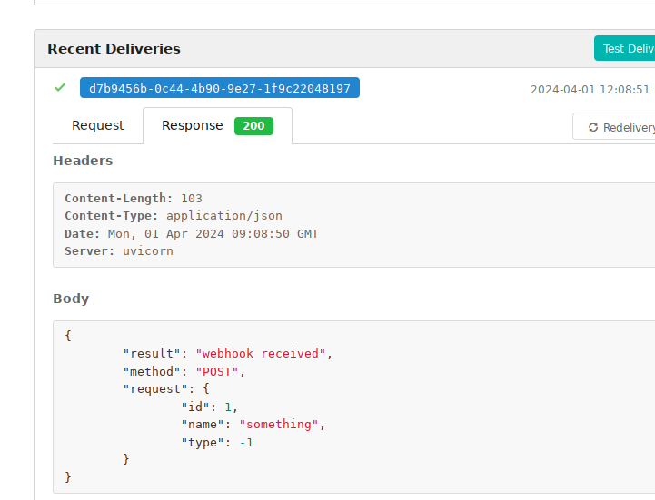
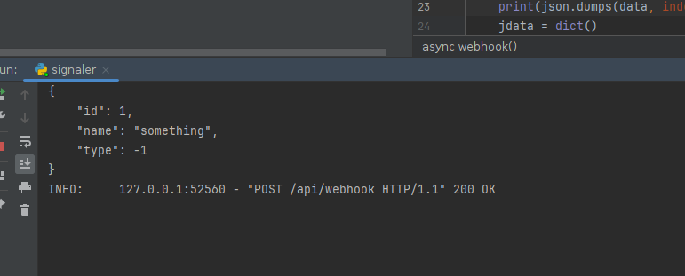

## GOG's git server addon

---


#### Very Important. There is No WaRRanty
#### It's my first project on ```go``` and can contain errors.

---

<br/>

It's contains a custom ```Webhooks``` addon.

<br/>
<br/>

### Patch & Build

1. doWnload ```gogs```
<pre>
    git clone --branch=v0.13.0 https://github.com/gogs/gogs.git
</pre>

1. dOwnload & cOpy ```gogs-git.patch```
<pre>
    git apply --ignore-whitespace {PATH_TO}/gogs-git.patch
</pre>

2. bUild ```gogs```
* PS: I'm not familiar with ```go``` language, so is better to look at the instruction on ```gogs``` homepage. 

<pre>
    go get
    go build
</pre>

<br/>




---

### HOWTO:

Choose custom hook



To time it's working with POST, GET, PATCH, DELETE, PUT http-methods.



With RAW json-requests you can trigger systems like Jenkins, TeamCity and so on...



The respOnse that you can see in the next image is just made by a python script that i have wrote for tests.



And there is a simple output in python script. 



